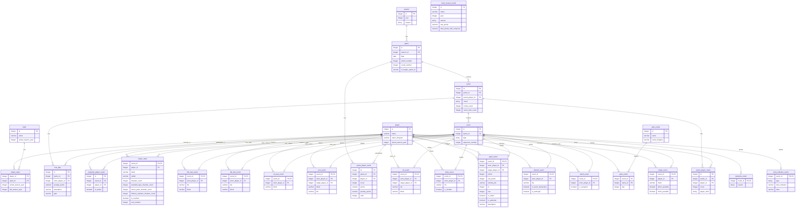

```mermaid
erDiagram
    %% 基本テーブル
    season {
        integer id PK
        integer year
        string season
    }

    team {
        integer id PK
        varchar name
        integer joined_season_year
    }

    player {
        integer id PK
        varchar name
        varchar name_furigana
        integer joined_season_year
    }

    player_team {
        integer player_id FK
        integer team_id FK
        integer joined_season_year
        integer left_season_year
    }

    %% 試合・局テーブル
    game {
        integer id PK
        integer season_id FK
        date date
        integer match_number
        integer round_number
        varchar m_league_game_id
    }

    kyoku {
        integer id PK
        integer game_id FK
        integer parent_player_id FK
        string round
        integer honba_count
        integer reach_stick_count
    }

    %% 結果テーブル
    game_player_result {
        integer id PK
        integer game_id FK
        integer player_id FK
        integer score
        numeric points
        numeric penalty_points
        integer rank
    }

    kyoku_player_result {
        integer id PK
        integer kyoku_id FK
        integer player_id FK
        integer score
        string player_wind
    }

    team_season_result {
        integer id PK
        varchar name
        integer year
        string season
        numeric raw_points
        numeric total_points_with_carryover
    }

    %% イベントテーブル
    event {
        integer id PK
        integer kyoku_id FK
        string type
        integer sequence_number
    }

    %% イベント詳細テーブル
    dora_indicator_event {
        integer event_id PK,FK
        string type
        varchar dora_indicator
        varchar dora
    }

    haipai_event {
        integer event_id PK,FK
        integer player_id FK
        varchar hand
        boolean tenho_possible
        boolean chiho_possible
    }

    agari_event {
        integer event_id PK,FK
        integer actor_player_id FK
        integer target_player_id FK
        integer points
        integer raw_points
        varchar winning_tile
        integer fu
        integer han
        boolean is_called
        boolean is_yakuman
        varchar description
    }

    yaku_event {
        integer event_id FK
        integer name_id FK
        integer han
    }

    ryukyoku_event {
        integer event_id PK,FK
        string reason
    }

    ryukyoku_player_event {
        integer id PK
        integer event_id FK
        integer player_id FK
        boolean is_tenpai
    }

    reach_event {
        integer event_id PK,FK
        integer actor_player_id FK
        boolean is_accepted
    }

    discard_event {
        integer event_id PK,FK
        integer actor_player_id FK
        varchar tile
        boolean is_reach_declaration
        boolean is_tsumogiri
    }

    draw_event {
        integer event_id PK,FK
        integer actor_player_id FK
        varchar tile
        boolean is_rinshan
    }

    chi_event {
        integer event_id PK,FK
        integer actor_player_id FK
        integer target_player_id FK
        varchar tile
        varchar block
    }

    pon_event {
        integer event_id PK,FK
        integer actor_player_id FK
        integer target_player_id FK
        varchar block
        varchar tile
    }

    an_kan_event {
        integer event_id PK,FK
        integer actor_player_id FK
        varchar block
    }

    dai_kan_event {
        integer event_id PK,FK
        integer actor_player_id FK
        varchar tile
        varchar block
    }

    sho_kan_event {
        integer event_id PK,FK
        integer actor_player_id FK
        varchar tile
        varchar block
    }

    %% その他のテーブル
    yaku_name {
        integer id PK
        varchar name
        varchar name_furigana
    }

    player_state {
        integer event_id PK,FK
        integer player_id FK
        varchar hand
        varchar called
        integer shanten_count
        integer standard_type_shanten_count
        integer seven_pairs_shanten_count
        integer thirteen_orphans_shanten_count
        boolean is_reached
        integer turn_number
    }

    foul_play {
        integer id PK
        integer kyoku_id FK
        integer actor_player_id FK
        numeric penalty_points
        varchar description
        varchar type
    }

    %% リレーションシップ
    season ||--o{ game : "has"
    game ||--o{ kyoku : "contains"
    game ||--o{ game_player_result : "has"
    kyoku ||--o{ kyoku_player_result : "has"
    kyoku ||--o{ event : "contains"
    kyoku ||--o{ foul_play : "has"

    player ||--o{ player_team : "belongs_to"
    team ||--o{ player_team : "has"
    player ||--o{ game_player_result : "participates"
    player ||--o{ kyoku_player_result : "plays"
    player ||--o{ haipai_event : "receives"
    player ||--o{ agari_event : "wins"
    player ||--o{ agari_event : "loses_to"
    player ||--o{ reach_event : "declares"
    player ||--o{ discard_event : "discards"
    player ||--o{ draw_event : "draws"
    player ||--o{ chi_event : "calls_chi"
    player ||--o{ pon_event : "calls_pon"
    player ||--o{ an_kan_event : "calls_ankan"
    player ||--o{ dai_kan_event : "calls_daikan"
    player ||--o{ sho_kan_event : "calls_shokan"
    player ||--o{ player_state : "has_state"
    player ||--o{ foul_play : "commits"
    player ||--o{ ryukyoku_player_event : "participates_in"

    event ||--o| dora_indicator_event : "details"
    event ||--o| haipai_event : "details"
    event ||--o| agari_event : "details"
    event ||--o| ryukyoku_event : "details"
    event ||--o| reach_event : "details"
    event ||--o| discard_event : "details"
    event ||--o| draw_event : "details"
    event ||--o| chi_event : "details"
    event ||--o| pon_event : "details"
    event ||--o| an_kan_event : "details"
    event ||--o| dai_kan_event : "details"
    event ||--o| sho_kan_event : "details"
    event ||--o{ yaku_event : "has_yaku"
    event ||--o{ ryukyoku_player_event : "involves"
    event ||--o{ player_state : "captures_state"

    yaku_name ||--o{ yaku_event : "defines"
```
